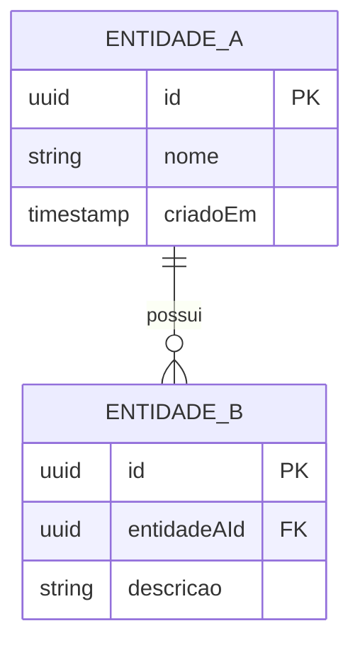
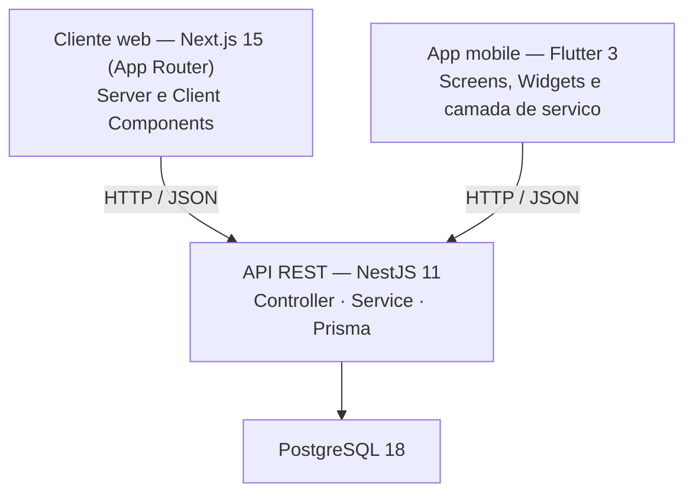

# PRD — Product Requirements Document

> **Instruções:** Este documento detalha os requisitos do sistema definido no Documento de Visão. Deve ser entregue ao final da **Etapa 1** e atualizado conforme o projeto evolui. Remova os blocos `> instrução` após preenchê-los.
>
> O contrato da API vive em documento separado: [`docs/contrato-api.md`](contrato-api.md). Este PRD define **o que** o sistema faz; o contrato define **como** os clientes conversam com ele.

---

## Identificação

| Campo | Valor |
|---|---|
| **Nome do projeto** | |
| **Grupo** | |
| **Versão do documento** | 1.0 |
| **Data de criação** | |
| **Última atualização** | |
| **Documento de Visão (ref.)** | `docs/visao.md` |
| **Contrato da API (ref.)** | `docs/contrato-api.md` |

---

## 1. Objetivo do produto

> Em no máximo 4 linhas, descreva o que o produto faz, para quem e qual problema resolve. Deve ser consistente com a seção 2.1 do Documento de Visão.

---

## 2. Personas

> Transforme os perfis de usuário da Visão em personas com mais detalhe. Ao menos 2. Registre em qual cliente cada persona passa a maior parte do tempo.

### Persona 1 — _(nome fictício)_

> _(ex: Ana, 34 anos, coordenadora de suporte)_

- **Contexto:** 
- **Cliente principal:** _(web / mobile)_
- **Objetivo principal no sistema:** 
- **Maior frustração atual (sem o sistema):** 
- **Critério de sucesso:** 

### Persona 2 — _(nome fictício)_

- **Contexto:** 
- **Cliente principal:** _(web / mobile)_
- **Objetivo principal no sistema:** 
- **Maior frustração atual (sem o sistema):** 
- **Critério de sucesso:** 

---

## 3. Requisitos funcionais

> Liste todos os requisitos funcionais organizados por módulo/épico. Use o identificador RF-XXX. Prioridade: **Alta** (MVP), **Média** (importante mas não bloqueia), **Baixa** (desejável).
>
> A coluna **Cliente** indica onde o requisito se manifesta na interface. Um mesmo requisito pode aparecer nos dois — mas se todos aparecerem nos dois, revise o recorte da seção 7.

### 3.1 Autenticação e sessão

> Entram aqui apenas os **comportamentos observáveis** de autenticação: o que o usuário faz e o que o sistema responde. As exigências de segurança que acompanham esses comportamentos ficam na seção 4, e quem pode fazer o quê fica na seção 5.

| ID | Descrição | Prioridade | Persona | Cliente |
|---|---|---|---|---|
| RF-001 | O usuário entra no sistema informando e-mail e senha e recebe acesso às funcionalidades do seu perfil | Alta | todas | web / mobile |
| RF-002 | O usuário encerra a sessão e deixa de ter acesso às rotas protegidas | Alta | todas | web / mobile |
| RF-003 | _(se houver auto-cadastro, recuperação de senha, troca de senha — descreva; se os usuários são criados por seed ou por um administrador, registre isso aqui e apague esta linha)_ | | | |

### 3.2 _(Nome do módulo)_

| ID | Descrição | Prioridade | Persona | Cliente |
|---|---|---|---|---|
| RF-010 | | | | |
| RF-011 | | | | |

### 3.3 _(Nome do módulo)_

| ID | Descrição | Prioridade | Persona | Cliente |
|---|---|---|---|---|
| RF-020 | | | | |

> Adicione quantos módulos forem necessários. Renumere conforme o projeto. Mínimo de 8 requisitos funcionais.

---

## 4. Requisitos não funcionais

> Requisito não funcional descreve **como** o sistema se comporta, não o que ele faz: qualidade, restrição, atributo. As quatro primeiras linhas de segurança já vêm preenchidas porque valem para todos os projetos desta disciplina — ajuste os critérios de aceitação ao seu caso e complete o restante da tabela.

| ID | Categoria | Descrição | Critério de aceitação |
|---|---|---|---|
| RNF-001 | Segurança — credenciais | Senhas são armazenadas com hash e nunca em texto puro | Nenhuma senha legível no banco; a coluna guarda o hash |
| RNF-002 | Segurança — sessão | O acesso é feito por token JWT, com validade definida | Token expirado é recusado com `401` |
| RNF-003 | Segurança — rotas | Toda rota que não seja pública exige token válido | Requisição sem token recebe `401`; requisição com perfil insuficiente recebe `403` |
| RNF-004 | Segurança — segredos | Chaves e credenciais ficam em variável de ambiente | Nenhum segredo versionado no repositório |
| RNF-005 | Desempenho | | |
| RNF-006 | Usabilidade | | |
| RNF-007 | Manutenibilidade | | |
| RNF-008 | Comportamento em rede instável _(mobile)_ | | |
| RNF-009 | _(outro)_ | | |

> **Por que autenticação aparece em três lugares.** É a dúvida mais comum ao preencher este documento, e a resposta é que ela tem três faces distintas:
>
> | Onde | O quê | Exemplo |
> |---|---|---|
> | Requisito funcional (seção 3.1) | O comportamento que o usuário observa | "o usuário entra com e-mail e senha" |
> | Requisito não funcional (esta seção) | A qualidade e a restrição desse comportamento | "a senha é guardada com hash e o token expira" |
> | Regra de negócio (seção 5) | Quem pode fazer o quê no domínio | "só o perfil bibliotecário cadastra livros" |
>
> Fazer login é algo que o sistema **faz** — por isso é funcional. Fazer login **com segurança** é uma qualidade de como ele faz — por isso é não funcional. Confundir os dois costuma produzir um PRD em que a segurança nunca é verificada, porque não virou critério de aceitação de ninguém.

---

## 5. Regras de negócio

> Liste as regras que governam o comportamento do sistema. Regras de negócio são diferentes de requisitos — elas descrevem restrições e políticas do domínio.
>
> **Toda regra listada aqui é implementada no backend.** A coluna final registra se algum cliente antecipa a validação por conveniência de interface — o que é permitido, desde que o servidor continue sendo a fonte da verdade.

| ID | Regra | Validação antecipada no cliente? |
|---|---|---|
| RN-001 | _(ex: Um chamado so pode ser fechado se estiver resolvido ha mais de 24 horas.)_ | não |
| RN-002 | | |
| RN-003 | | |

**Autorização — quem pode o quê.** As regras de acesso por perfil são regras de negócio: elas dizem o que cada papel do domínio tem direito de fazer. A tabela completa vive em `docs/contrato-api.md`, seção "Perfis e permissões", porque é lá que ela vira `403`. Registre aqui apenas as que não sejam óbvias a partir dos perfis:

| ID | Regra de autorização | Perfil |
|---|---|---|
| RN-A01 | _(ex: Um leitor so pode ver e devolver os proprios emprestimos.)_ | |
| RN-A02 | | |

---

## 6. Modelo de dados

> Descreva as principais entidades do sistema, seus atributos e relacionamentos. O diagrama deve corresponder ao `schema.prisma` do backend — se divergirem, um dos dois está errado.

### 6.1 Diagrama ER

> Substitua pelas entidades reais do seu domínio. Lembre-se da convenção: substantivo de domínio em português, sem acento no identificador.

### 6.2 Descrição das entidades

| Entidade | Responsabilidade | Principais atributos |
|---|---|---|
| | | |
| | | |

---

## 7. Recorte web/mobile

> **Seção obrigatória.** Distribua as funcionalidades entre os dois clientes e justifique. O critério da justificativa é o **contexto de uso** descrito na Visão, não a facilidade de implementação.

| Funcionalidade | Web | Mobile | Justificativa |
|---|---|---|---|
| | ✅ | — | |
| | — | ✅ | |
| | ✅ | ✅ | |

**O que ficou de fora do mobile e por quê:**

**O que ficou de fora do web e por quê:**

> Declare aqui o **recorte mobile mínimo**: de 1 a 3 casos de uso que o app precisa cobrir. Pelo menos um deles precisa envolver o app **lendo e escrevendo** dados contra a API — só consultar informação não é suficiente para caracterizar o app como cliente funcional.

**Recorte mobile mínimo (1 a 3 casos de uso, com leitura e escrita na API):**
- 

---

## 8. Arquitetura da solução

### 8.1 Visão geral dos componentes

### 8.2 Estrutura dos três projetos

> A organização das pastas `backend/`, `web/` e `mobile/` é a que está no `README.md` da raiz. Não a repita aqui: registre apenas os **desvios** que o seu domínio exigir, com o motivo.

| Componente | Desvio em relação ao README | Motivo |
|---|---|---|
| Backend | | |
| Cliente web | | |
| App mobile | | |

> Se não houver desvio, escreva "nenhum". Desvio sem motivo declarado vira dívida que ninguém lembra de onde veio.

### 8.3 Módulos e recursos do backend

> Liste os módulos que a API terá, um por recurso do domínio. É o que orienta o `nest g resource`.

| Módulo | Recurso do domínio | Endpoints previstos |
|---|---|---|
| | | |
| | | |

### 8.4 Decisões técnicas por componente

| Componente | Decisão a tomar | Escolha do grupo | Justificativa |
|---|---|---|---|
| Backend | Estratégia de autenticação (JWT simples, com refresh) | | |
| Backend | Formato de identificador (uuid, cuid, inteiro) | | |
| Web | Fronteira Server / Client Components | | |
| Web | Estratégia de revalidação e cache | | |
| Mobile | Gerência de estado (`setState`, Provider, Riverpod, Bloc) | | |
| Mobile | Nível de autenticação e armazenamento do token | | |

> **Gerência de estado:** `setState` é suficiente para o escopo esperado do app. Provider, Riverpod, Bloc ou similares são diferencial, não requisito.
>
> **Nível de autenticação do mobile:** escolha um dos três níveis abaixo e registre a escolha na tabela acima. Os três são aceitos — o que importa é a escolha estar declarada aqui.
>
> - **Completa** — JWT igual ao do cliente web: token persistido no dispositivo, expiração tratada, logout implementado.
> - **Simplificada** — login real contra a API, mas o token fica apenas em memória (perdido ao fechar o app).
> - **Simulada** — o app obtém um token de forma fixa (por exemplo, login automático com credencial fixa), sem tela de login.

### 8.5 Tecnologias e versões

| Tecnologia | Versão | Papel |
|---|---|---|
| Node.js | 22 LTS | Runtime do backend |
| NestJS | 11 | Framework da API |
| Prisma | 7 (com `@prisma/adapter-pg`) | ORM e migrations |
| PostgreSQL | 18 | Banco de dados |
| React | 19 | Biblioteca de interface |
| Next.js | 15 (App Router) | Framework do cliente web |
| Flutter / Dart | 3 | Framework do app mobile |
| Docker | | Banco de dados local |

---

## 9. Planejamento de sprints

> Distribua os requisitos funcionais entre as sprints de cada etapa, conforme o calendário da turma. Atualize esta seção conforme o projeto avança.
>
> Acrescente ou remova linhas conforme o número de sprints definido. Etapas 2, 3 e 4 podem se sobrepor — declare a sobreposição em vez de fingir que o trabalho é sequencial.

| Sprint | Etapa | Tema | Requisitos previstos | Responsáveis | Entregáveis |
|---|---|---|---|---|---|
| 1 | Etapa 1 | Contrato e fundação | — | | PRD, contrato e backend rodando |
| 2 | Etapa 2 | | | | |
| 3 | Etapa 2 / 3 | | | | |
| 4 | Etapa 3 | | | | |
| 5 | Etapa 4 | | | | |
| 6 | Etapa 5 | Integração e fechamento | — | todos | Entrega final |

> Os três checkpoints caem ao final das etapas 2, 3 e 4 — um por componente. Distribua as sprints de forma que cada etapa chegue ao seu checkpoint com o componente correspondente funcionando.

---

## 10. Critérios de aceite (MVP)

> Quais são as condições mínimas para considerar o projeto concluído? Liste os cenários principais. Ao menos um critério deve ser de integração — algo que só se verifica com os três componentes no ar.

- [ ] 
- [ ] 
- [ ] 
- [ ] Um registro criado pelo cliente web aparece corretamente no app mobile, e vice-versa
- [ ] O app apresenta um token válido à API e vê os mesmos dados do cliente web, qualquer que seja o nível de autenticação declarado

---

## 11. Fora do escopo (explícito)

> Liste o que foi deliberadamente excluído para manter o escopo viável dentro do prazo.

- 
- 

---

## 12. Histórico de revisões

| Versão | Data | Descrição |
|---|---|---|
| 1.0 | | Versão inicial |
| | | |
